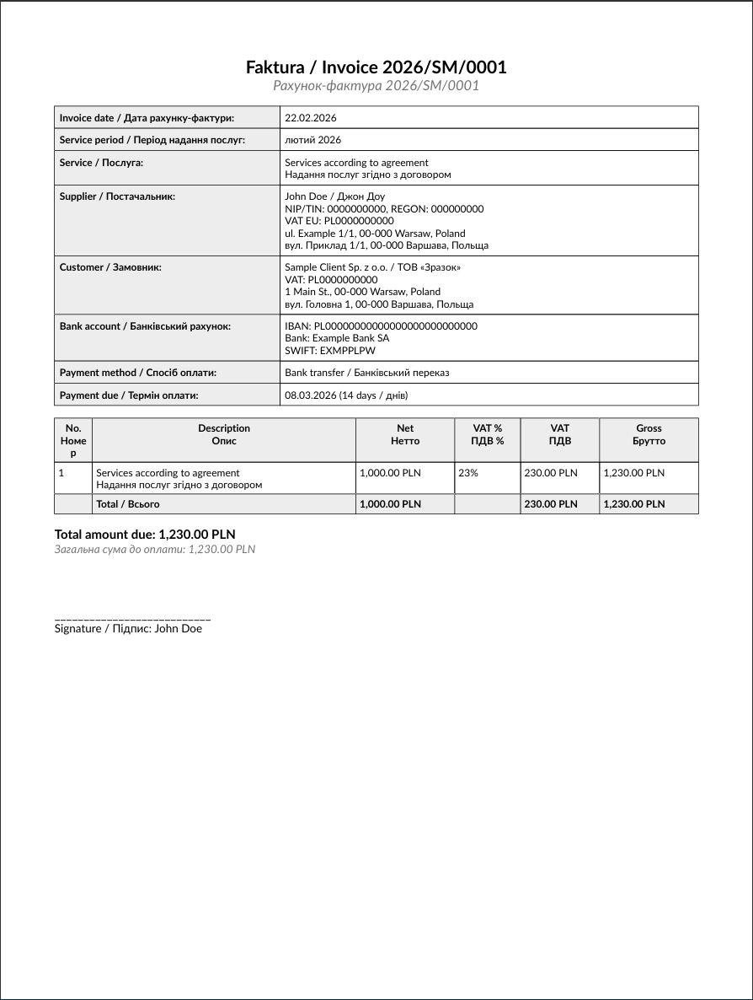
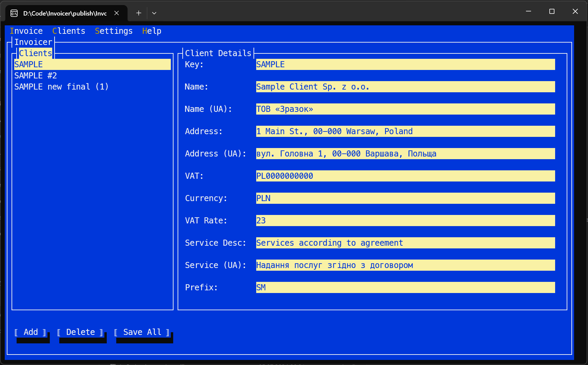
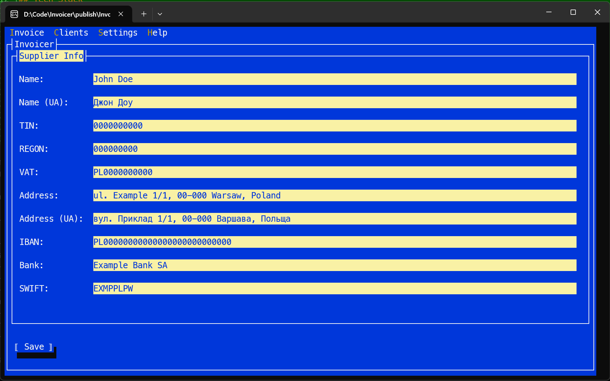

# Invoicer

A terminal-based bilingual (English/Ukrainian) invoice generator for freelancers and contractors.


## Features

- **TUI interface** — keyboard-driven Terminal.Gui application, no browser or GUI framework needed
- **Bilingual output** — invoices generated in English and Ukrainian side by side
- **Dual format** — generates both DOCX and PDF independently (no Word/LibreOffice required)
- **Multiple clients** — configure and manage multiple clients with different currencies, VAT rates, and service descriptions
- **Smart defaults** — auto-increments invoice numbers, calculates service month based on configurable rules, pre-fills amounts
- **TOML config** — human-readable configuration file, editable both in-app and by hand

## Screenshots

|                     Create Invoice                     |                 Generated PDF                  |
|:------------------------------------------------------:|:----------------------------------------------:|
|  |  |

| Client Management | Settings |
|:-:|:-:|
|  |  |

## Getting Started

### Download

Grab the latest release from the [Releases](../../releases) page. The published build is self-contained — no .NET runtime installation needed.

### Build from Source

Requires [.NET 9 SDK](https://dotnet.microsoft.com/download/dotnet/9.0).

```bash
git clone https://github.com/yourusername/Invoicer.git
cd Invoicer
dotnet build src/Invoicer/Invoicer.csproj
dotnet run --project src/Invoicer
```

To publish a self-contained executable:

```bash
dotnet publish src/Invoicer/Invoicer.csproj -c Release -r win-x64 --self-contained -o publish
```

## Usage

On first launch, a default `config.toml` is created next to the executable. Edit it directly or use the in-app settings.

### Navigation

- **F9** or **Alt** — open the menu bar
- **Invoice > Create New** — main invoice creation form
- **Clients > List/Edit Clients** — manage client configurations
- **Settings** — edit supplier info and output paths

### Creating an Invoice

1. Select a client
2. Verify/adjust the invoice number, date, and amount
3. Choose output formats (DOCX, PDF, or both)
4. Click **Generate**

Files are saved to the configured output directory following the pattern:
```
{output.directory}/{output.pattern}/{output.filename}.{ext}

Example: ./output/2026/Invoices/2026-02-22_ACME_PL.docx
```

## Configuration

The `config.toml` file has three sections:

### Supplier

Your business details — name, tax IDs, address, bank account (in both English and Ukrainian).

### Output

| Field | Description | Placeholders |
|-------|-------------|-------------|
| `directory` | Base output directory | — |
| `pattern` | Subfolder structure | `{year}` |
| `filename` | File name (without extension) | `{date}`, `{client}` |

### Clients

Each `[[clients]]` entry defines a client with:

| Field | Description |
|-------|-------------|
| `key` | Short identifier (used in filenames) |
| `name` / `name_ua` | Client name in English / Ukrainian |
| `address` / `address_ua` | Address in English / Ukrainian |
| `vat` | Client VAT number |
| `currency` | Invoice currency (`PLN`, `USD`, etc.) |
| `vat_rate` | VAT percentage (0 for VAT-exempt) |
| `service_description` / `service_description_ua` | Service line item text |
| `invoice_prefix` | Prefix for invoice numbering |
| `default_amount` | Pre-filled net amount |
| `month_offset_rule` | Service month calculation rule |

#### Month Offset Rules

- `early_previous` — days 1-20: previous month, days 21-31: current month
- `early_current` — days 1-20: current month, days 21-31: next month

## Tech Stack

| Component | Library |
|-----------|---------|
| TUI | [Terminal.Gui](https://github.com/gui-cs/Terminal.Gui) v2 |
| PDF | [QuestPDF](https://www.questpdf.com/) |
| DOCX | [DocumentFormat.OpenXml](https://github.com/dotnet/Open-XML-SDK) |
| Config | [Tomlyn](https://github.com/xoofx/Tomlyn) |
| Runtime | .NET 9 |

## License

MIT
