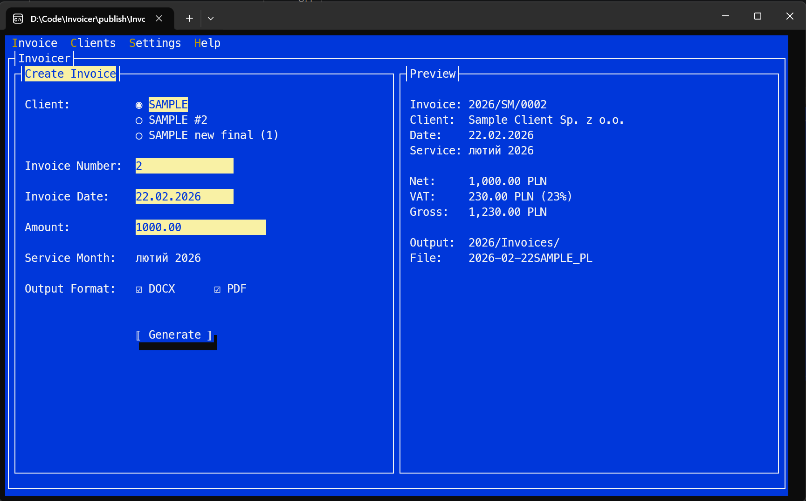
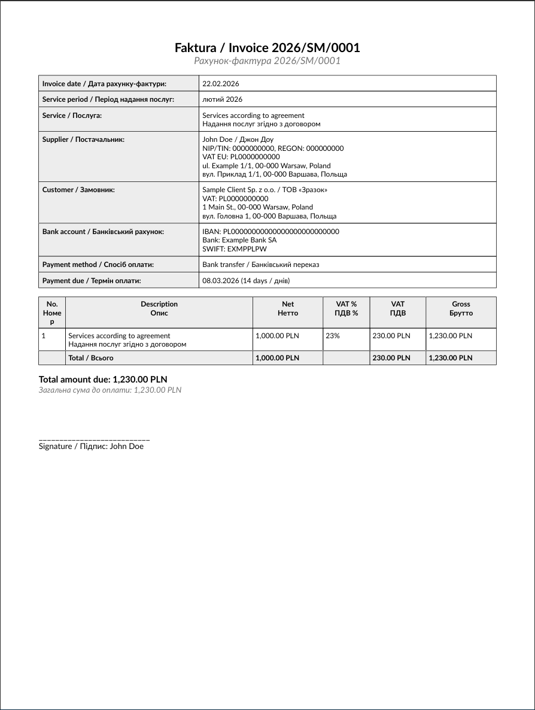
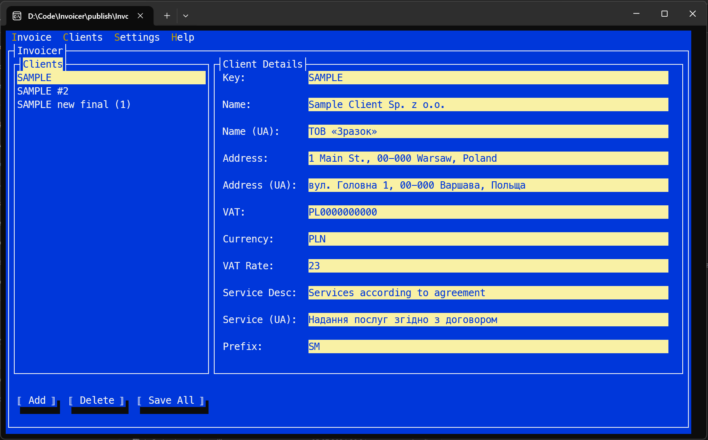
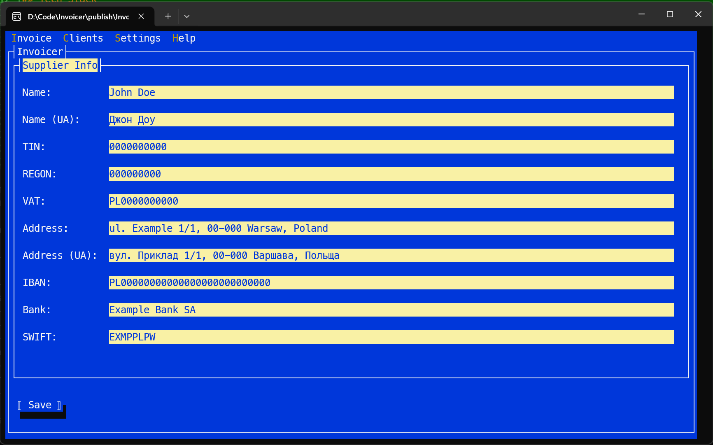

# Invoicer

A terminal-based bilingual (English/Ukrainian) invoice generator for freelancers and contractors.



## Features

- **TUI interface** — keyboard-driven Terminal.Gui application, no browser or GUI framework needed
- **Bilingual output** — invoices generated in English and Ukrainian side by side
- **Multi-format output** — generates DOCX, PDF, and KSeF XML with independent selection
- **Multiple clients** — configure and manage multiple clients with different currencies, VAT rates, and service descriptions
- **Smart defaults** — auto-increments invoice numbers, calculates service month based on configurable rules, pre-fills amounts
- **TOML config** — human-readable configuration file, editable both in-app and by hand
- **Self-updating** — checks GitHub for new releases and installs them in place, on your confirmation

## Screenshots

|                     Create Invoice                     |                 Generated PDF                  |
| :----------------------------------------------------: | :--------------------------------------------: |
|  |  |

|            Client Management             |                  Settings                  |
| :--------------------------------------: | :----------------------------------------: |
|  |  |

## Getting Started

### Download

Grab the latest release from the [Releases](../../releases) page. The published build is self-contained — no .NET runtime installation needed.

### Build from Source

Requires [.NET 9 SDK](https://dotnet.microsoft.com/download/dotnet/9.0).

```bash
git clone https://github.com/yourusername/Invoicer.git
cd Invoicer
dotnet build src/Invoicer/Invoicer.csproj
dotnet run --project src/Invoicer
```

To publish a self-contained executable:

```bash
dotnet publish src/Invoicer/Invoicer.csproj -c Release -r win-x64 --self-contained -o publish
```

## Usage

On first launch, a default `config.toml` is created next to the executable. Edit it directly or use the in-app settings.

### Navigation

- **F9** or **Alt** — open the menu bar
- **Invoice > Create New** — main invoice creation form
- **Clients > List/Edit Clients** — manage client configurations
- **Settings** — edit supplier info and output paths
- **Help > Check for Updates** — look for a new release right now

### Creating an Invoice

1. Select a client
2. Verify/adjust the invoice number, date, and amount
3. Choose output formats (DOCX, PDF, KSeF XML, or any combination)
4. Click **Generate**

Files are saved to the configured output directory following the pattern:

```
{output.directory}/{output.pattern}/{output.filename}.{ext}

Example: ./output/2026/Invoices/20260222_ACME_PL.docx
```

## Updates

Invoicer checks GitHub for a newer release when it starts. The check runs in the background and stays silent unless there is something newer — if you are offline or GitHub is unreachable, nothing is reported and startup is unaffected. You can also check on demand from **Help > Check for Updates**, which always tells you the outcome.

When an update is found you are shown the version, download size, and release notes, and you choose whether to install it. Nothing is downloaded until you confirm. Installing replaces the executable in place and restarts it; your `config.toml` and generated invoices are untouched. The previous executable is kept beside the new one as `Invoicer.exe.old` until the next launch, so you can rename it back if you need to.

## Configuration

The `config.toml` file has four sections:

### Supplier

Your business details — name, tax IDs, address, bank account (in both English and Ukrainian).

### Output

| Field                      | Description                                       | Placeholders         |
| -------------------------- | ------------------------------------------------- | -------------------- |
| `directory`                | Base output directory                             | —                    |
| `pattern`                  | Subfolder structure                               | `{year}`             |
| `filename`                 | File name (without extension)                     | `{date}`, `{client}` |
| `generate_docx_by_default` | Default DOCX checkbox state in Create Invoice     | —                    |
| `generate_pdf_by_default`  | Default PDF checkbox state in Create Invoice      | —                    |
| `generate_xml_by_default`  | Default KSeF XML checkbox state in Create Invoice | —                    |

### Update

| Field              | Description                                                            | Default            |
| ------------------ | ---------------------------------------------------------------------- | ------------------ |
| `check_on_startup` | Check for a new release in the background at launch                    | `true`             |
| `repository`       | GitHub repository to check, as `owner/name`                            | `zeusapps/Invoicer` |
| `dismissed_version` | Version you chose to skip; set automatically when you click **Later** | —                  |

### Clients

Each `[[clients]]` entry defines a client with:

| Field                                            | Description                           |
| ------------------------------------------------ | ------------------------------------- |
| `key`                                            | Short identifier (used in filenames)  |
| `name` / `name_ua`                               | Client name in English / Ukrainian    |
| `address` / `address_ua`                         | Address in English / Ukrainian        |
| `vat`                                            | Client VAT number                     |
| `currency`                                       | Invoice currency (`PLN`, `USD`, etc.) |
| `vat_rate`                                       | VAT percentage (0 for VAT-exempt)     |
| `service_description` / `service_description_ua` | Service line item text                |
| `invoice_prefix`                                 | Prefix for invoice numbering          |
| `default_amount`                                 | Pre-filled net amount                 |
| `month_offset_rule`                              | Service month calculation rule        |

#### Month Offset Rules

- `early_previous` — days 1-20: previous month, days 21-31: current month
- `early_current` — days 1-20: current month, days 21-31: next month

## Tech Stack

| Component | Library                                                          |
| --------- | ---------------------------------------------------------------- |
| TUI       | [Terminal.Gui](https://github.com/gui-cs/Terminal.Gui) v2        |
| PDF       | [QuestPDF](https://www.questpdf.com/)                            |
| DOCX      | [DocumentFormat.OpenXml](https://github.com/dotnet/Open-XML-SDK) |
| Config    | [Tomlyn](https://github.com/xoofx/Tomlyn)                        |
| Runtime   | .NET 9                                                           |

## License

MIT
