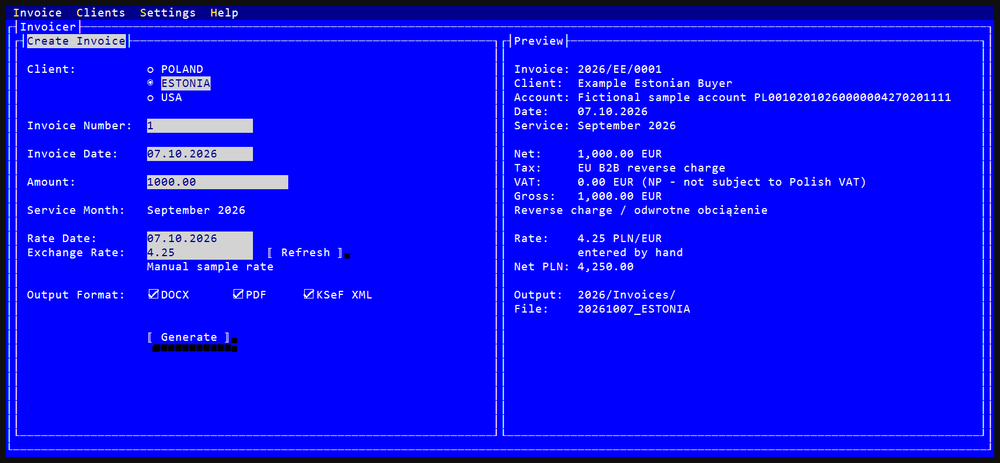
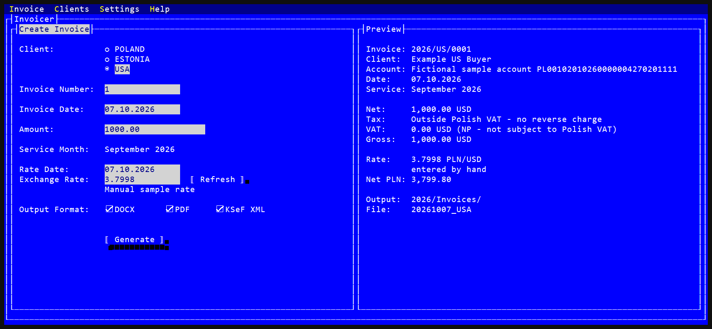
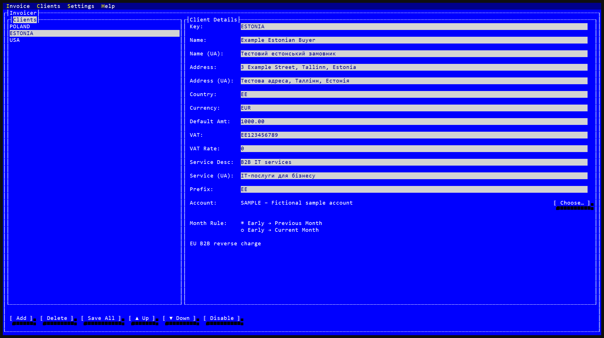
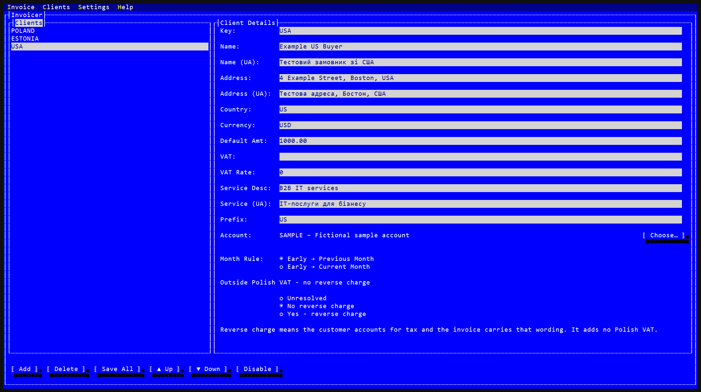
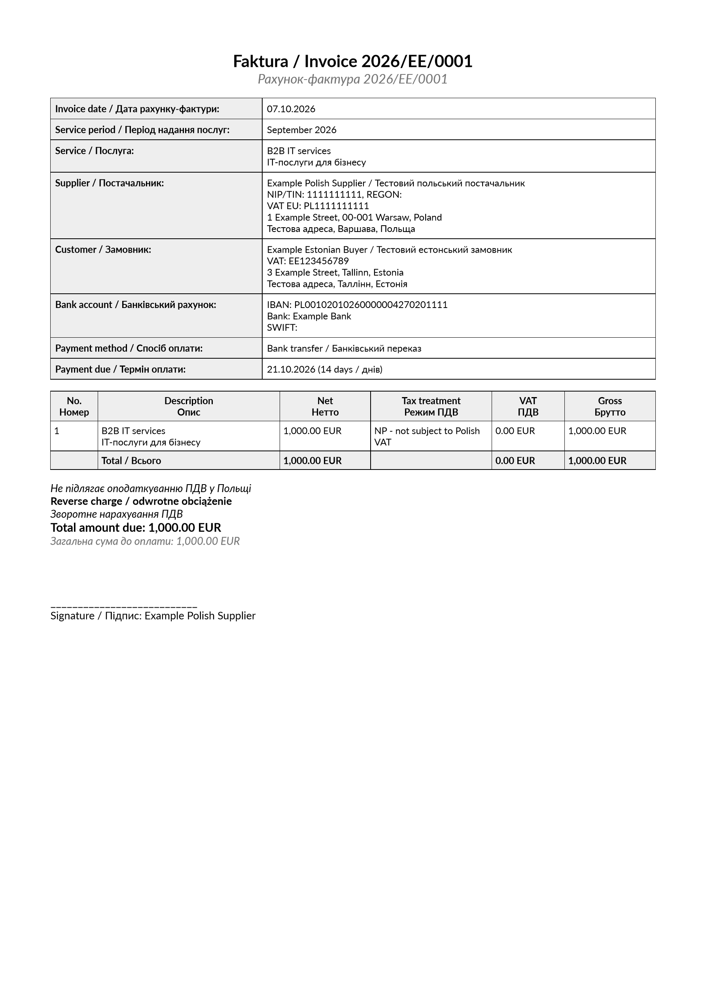
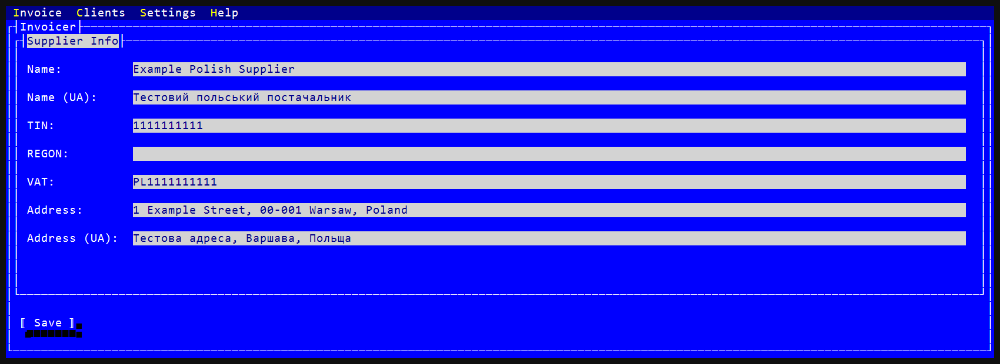

# Invoicer

A terminal-based bilingual (English/Ukrainian) invoice generator for freelancers and contractors.



## Features

- **TUI interface** — keyboard-driven Terminal.Gui application, no browser or GUI framework needed
- **Bilingual output** — invoices generated in English and Ukrainian side by side
- **Multi-format output** — generates DOCX, PDF, and KSeF XML with independent selection
- **Multiple clients** — configure and manage multiple clients with different currencies, VAT rates, and service descriptions
- **Smart defaults** — auto-increments invoice numbers, calculates service month based on configurable rules, pre-fills amounts
- **TOML config** — human-readable configuration file, editable both in-app and by hand
- **Self-updating** — checks GitHub for new releases and installs them in place, on your confirmation

## Screenshots

The current screens use the fictional Poland, Estonia and US configuration shown below. Estonia shows EU reverse charge; the US example shows services outside Polish VAT without reverse charge. Click an image to view it at full size.

| Estonia: EU reverse-charge preview | US: outside Polish VAT preview |
| :---: | :---: |
| [](docs/screenshots/create_invoice.png) | [](docs/screenshots/create_invoice_us.png) |

| Estonian client: derived reverse charge | US client: configurable reverse charge |
| :---: | :---: |
| [](docs/screenshots/clients_estonia.png) | [](docs/screenshots/clients.png) |

| Generated Estonian invoice (PDF) | Supplier settings |
| :---: | :---: |
| [](docs/screenshots/pdf_output.png) | [](docs/screenshots/settings.png) |

## Getting Started

### Download

Grab the latest release from the [Releases](../../releases) page. The published build is self-contained — no .NET runtime installation needed.

### Build from Source

Requires [.NET 9 SDK](https://dotnet.microsoft.com/download/dotnet/9.0).

```bash
git clone https://github.com/yourusername/Invoicer.git
cd Invoicer
dotnet build src/Invoicer/Invoicer.csproj
dotnet run --project src/Invoicer
```

To publish a self-contained executable:

```bash
dotnet publish src/Invoicer/Invoicer.csproj -c Release -r win-x64 --self-contained -o publish
```

## Usage

On first launch, a default `config.toml` is created next to the executable. Edit it directly or use the in-app settings.

### Navigation

- **F9** or **Alt** — open the menu bar
- **Invoice > Create New** — main invoice creation form
- **Clients > List/Edit Clients** — manage client configurations
- **Settings** — edit supplier info and output paths
- **Help > Check for Updates** — look for a new release right now

### Creating an Invoice

1. Select a client
2. Verify/adjust the invoice number, date, and amount
3. Choose output formats (DOCX, PDF, KSeF XML, or any combination)
4. Click **Generate**

Files are saved to the configured output directory following the pattern:

```
{output.directory}/{output.pattern}/{output.filename}.{ext}

Example: ./output/2026/Invoices/20260222_ACME_PL.docx
```

## Updates

Invoicer checks GitHub for a newer release when it starts. The check runs in the background and stays silent unless there is something newer — if you are offline or GitHub is unreachable, nothing is reported and startup is unaffected. You can also check on demand from **Help > Check for Updates**, which always tells you the outcome.

When an update is found you are shown the version, download size, and release notes, and you choose whether to install it. Nothing is downloaded until you confirm. Installing replaces the executable in place and restarts it; your `config.toml` and generated invoices are untouched. The previous executable is kept beside the new one as `Invoicer.exe.old` until the next launch, so you can rename it back if you need to.

## Configuration

The `config.toml` file has four sections:

### Supplier

Your business details — name, tax IDs, address, bank account (in both English and Ukrainian).

### Output

| Field                      | Description                                       | Placeholders         |
| -------------------------- | ------------------------------------------------- | -------------------- |
| `directory`                | Base output directory                             | —                    |
| `pattern`                  | Subfolder structure                               | `{year}`             |
| `filename`                 | File name (without extension)                     | `{date}`, `{client}` |
| `generate_docx_by_default` | Default DOCX checkbox state in Create Invoice     | —                    |
| `generate_pdf_by_default`  | Default PDF checkbox state in Create Invoice      | —                    |
| `generate_xml_by_default`  | Default KSeF XML checkbox state in Create Invoice | —                    |

### Update

| Field              | Description                                                            | Default            |
| ------------------ | ---------------------------------------------------------------------- | ------------------ |
| `check_on_startup` | Check for a new release in the background at launch                    | `true`             |
| `repository`       | GitHub repository to check, as `owner/name`                            | `zeusapps/Invoicer` |
| `dismissed_version` | Version you chose to skip; set automatically when you click **Later** | —                  |

### Clients

Each `[[clients]]` entry defines a client with:

| Field                                            | Description                           |
| ------------------------------------------------ | ------------------------------------- |
| `key`                                            | Short identifier (used in filenames)  |
| `name` / `name_ua`                               | Client name in English / Ukrainian    |
| `address` / `address_ua`                         | Address in English / Ukrainian        |
| `vat`                                            | Client VAT number                     |
| `currency`                                       | Invoice currency (`PLN`, `USD`, etc.) |
| `country`                                        | Required country code (`PL`, `EE`, `US`) |
| `billing_account`                                | Key of a defined billing account      |
| `vat_rate`                                       | Domestic rate; 0 means no Polish VAT for supported foreign services |
| `reverse_charge`                                 | Non-EU buyer tax accounting choice (`true`/`false`) |
| `service_description` / `service_description_ua` | Service line item text                |
| `invoice_prefix`                                 | Prefix for invoice numbering          |
| `default_amount`                                 | Pre-filled net amount                 |
| `month_offset_rule`                              | Service month calculation rule        |

#### Month Offset Rules

- `early_previous` — days 1-20: previous month, days 21-31: current month
- `early_current` — days 1-20: current month, days 21-31: next month

### Poland, Estonia and US service contracts

These treatments support ordinary B2B services supplied by a Polish business. Establish the applicable service rule and the customer's EU VAT registration outside the application, including VIES verification when applicable. Identifier checks validate syntax and consistency, rather than live registration.

| Contract | Settings | Invoice | FA(3) XML |
| --- | --- | --- | --- |
| Poland | `country = "PL"`, `vat_rate = 23` | Polish VAT 23%; no reverse charge | `P_12=23`, `P_13_1`/`P_14_1`, `P_18=2` |
| Estonia | `country = "EE"`, `vat_rate = 0` | NP; customer accounts for VAT; reverse-charge wording | `np II`, `P_13_9`, `P_18=1`, seller prefix `PL` |
| US contract | `country = "US"`, `vat_rate = 0`, `reverse_charge = false` | NP; no Polish VAT or reverse-charge wording | `np I`, `P_13_8`, `P_18=2` |

`vat_rate = 0` for foreign services is an internal value meaning no Polish VAT is charged. Documents show `NP - not subject to Polish VAT` and a zero monetary VAT amount. It does not represent a domestic zero-rated or exempt sale. When reverse charge applies, documents also show `Reverse charge / odwrotne obciążenie` with a Ukrainian explanation. The buyer accounts for its local tax; no Estonian tax percentage is added to the amount payable.

Missing US choices default to false and the next save writes `reverse_charge = false`. Explicit true/false values are preserved. Other non-EU clients require an explicit choice before generation; unresolved drafts can still be saved. Enabling non-EU reverse charge changes the wording and `P_18` to 1 while preserving NP classification and all amounts. Determine that choice from the actual contract/tax circumstances; this application does not calculate US sales/use tax. Poland derives false and other EU clients derive true; contradictory overrides are rejected. Supported domestic rates are 23, 22, 8, 7 and 5.

Upgrading changes the prior automatic US `P_18=1` to `P_18=2` unless explicitly overridden. Keep the former Polish client separately when adding an Estonian client if historical regeneration is needed. Every format now requires a seller NIP and valid Polish/EU buyer identification. Estonia also requires the supplier's EU VAT number to equal `PL` plus its NIP. Stored EU buyer numbers may omit their prefix; documents display the normalized complete identifier. Empty non-EU identification remains allowed.

All selected outputs are validated before creating directories or replacing files. Failed validation preserves numbering and output preferences. Foreign-currency XML needs a positive exchange rate with at most six meaningful decimal places; a missing NBP rate leaves PDF/DOCX available by deselecting XML. XML for a Polish client in a foreign currency remains unsupported, while documents alone remain available.

XML export does not issue an accepted KSeF invoice. Submission, UPO/acceptance checks, KSeF numbers and recipient visualization/QR requirements remain the responsibility of the external issuance workflow. This change does not submit invoices, rewrite past invoices, or cover goods, special service rules, domestic zero-rated/exempt sales or corrections.

The complete example below uses fictional format-valid identities and account details. Replace them with actual verified party and payment details before operational use. Each contract has a separate client entry and its own numbering.

<!-- tax-treatment-sample-start -->
```toml
[supplier]
name = "Example Polish Supplier"
name_ua = "Тестовий польський постачальник"
tin = "1111111111"
vat = "PL1111111111"
regon = ""
address = "1 Example Street, 00-001 Warsaw, Poland"
address_ua = "Тестова адреса, Варшава, Польща"

[[billing_accounts]]
key = "SAMPLE"
label = "Fictional sample account"
iban = "PL00102010260000004270201111"
bank = "Example Bank"
swift = ""
currency = ""

[output]
directory = "./output/tax-treatment-samples"
pattern = "{year}/Invoices"
filename = "{date}_{client}"
generate_docx_by_default = true
generate_pdf_by_default = true
generate_xml_by_default = true

[[clients]]
key = "POLAND"
name = "Example Polish Buyer"
name_ua = "Тестовий польський замовник"
address = "2 Example Street, 00-001 Warsaw, Poland"
address_ua = "Тестова адреса, Варшава, Польща"
country = "PL"
vat = "PL9999999999"
billing_account = "SAMPLE"
currency = "PLN"
vat_rate = 23
service_description = "B2B IT services"
service_description_ua = "ІТ-послуги для бізнесу"
invoice_prefix = "PL"
default_amount = 1000.00
month_offset_rule = "early_previous"
last_invoice_number = 0
enabled = true

[[clients]]
key = "ESTONIA"
name = "Example Estonian Buyer"
name_ua = "Тестовий естонський замовник"
address = "3 Example Street, Tallinn, Estonia"
address_ua = "Тестова адреса, Таллінн, Естонія"
country = "EE"
vat = "EE123456789"
billing_account = "SAMPLE"
currency = "EUR"
vat_rate = 0
service_description = "B2B IT services"
service_description_ua = "ІТ-послуги для бізнесу"
invoice_prefix = "EE"
default_amount = 1000.00
month_offset_rule = "early_previous"
last_invoice_number = 0
enabled = true

[[clients]]
key = "USA"
name = "Example US Buyer"
name_ua = "Тестовий замовник зі США"
address = "4 Example Street, Boston, USA"
address_ua = "Тестова адреса, Бостон, США"
country = "US"
vat = ""
billing_account = "SAMPLE"
currency = "USD"
vat_rate = 0
reverse_charge = false
service_description = "B2B IT services"
service_description_ua = "ІТ-послуги для бізнесу"
invoice_prefix = "US"
default_amount = 1000.00
month_offset_rule = "early_previous"
last_invoice_number = 0
enabled = true
```
<!-- tax-treatment-sample-end -->

Generate the fictional sample matrix and validate each XML locally with:

```powershell
$env:INVOICER_SAMPLE_DIRECTORY = Join-Path (Get-Location) 'output/tax-treatment-samples'
dotnet test tests/Invoicer.Tests/Invoicer.Tests.csproj --filter FullyQualifiedName~GenerateDocumentSamples
Remove-Item Env:INVOICER_SAMPLE_DIRECTORY
```

This uses invoice date 2026-10-07, number 1, net 1000, a fixed XML clock and illustrative manually supplied rates (EUR 4.25, USD 3.7998). These rates are fictional verification inputs. It also produces `USA_RC`, a separate US sample with reverse charge explicitly enabled. The test reads the sample above into an isolated config, without saving operational settings or contacting NBP/KSeF.

## Tech Stack

| Component | Library                                                          |
| --------- | ---------------------------------------------------------------- |
| TUI       | [Terminal.Gui](https://github.com/gui-cs/Terminal.Gui) v2        |
| PDF       | [QuestPDF](https://www.questpdf.com/)                            |
| DOCX      | [DocumentFormat.OpenXml](https://github.com/dotnet/Open-XML-SDK) |
| Config    | [Tomlyn](https://github.com/xoofx/Tomlyn)                        |
| Runtime   | .NET 9                                                           |

## License

MIT
